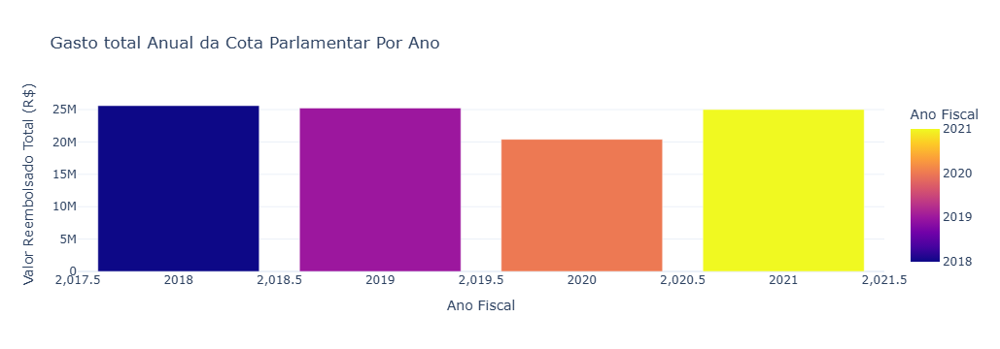
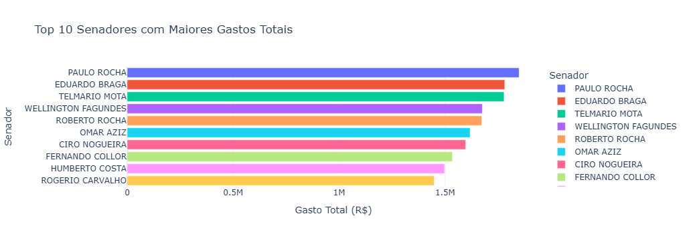
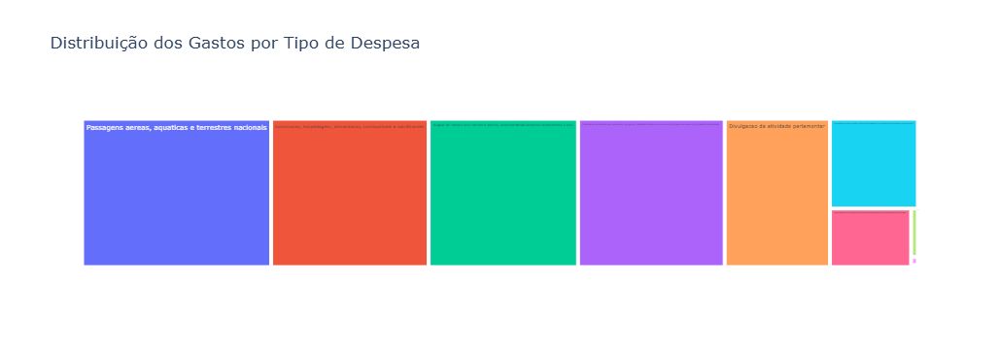
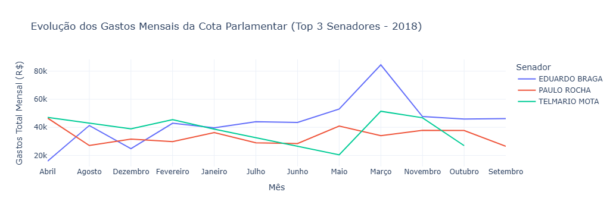
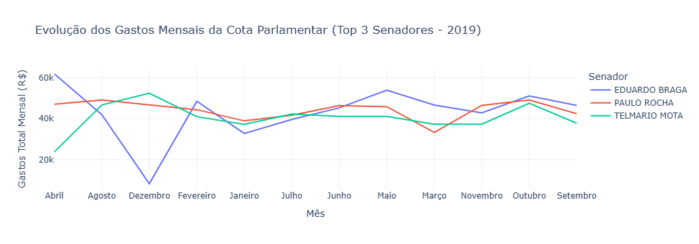
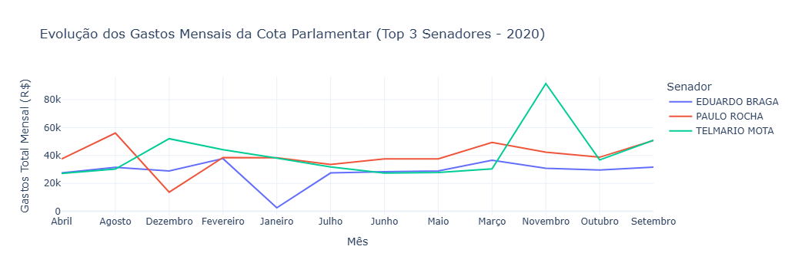
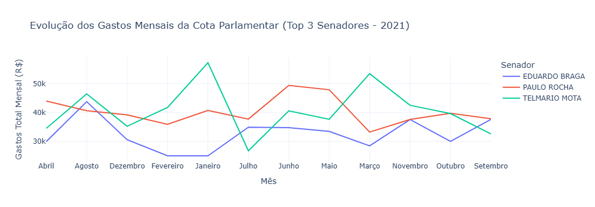
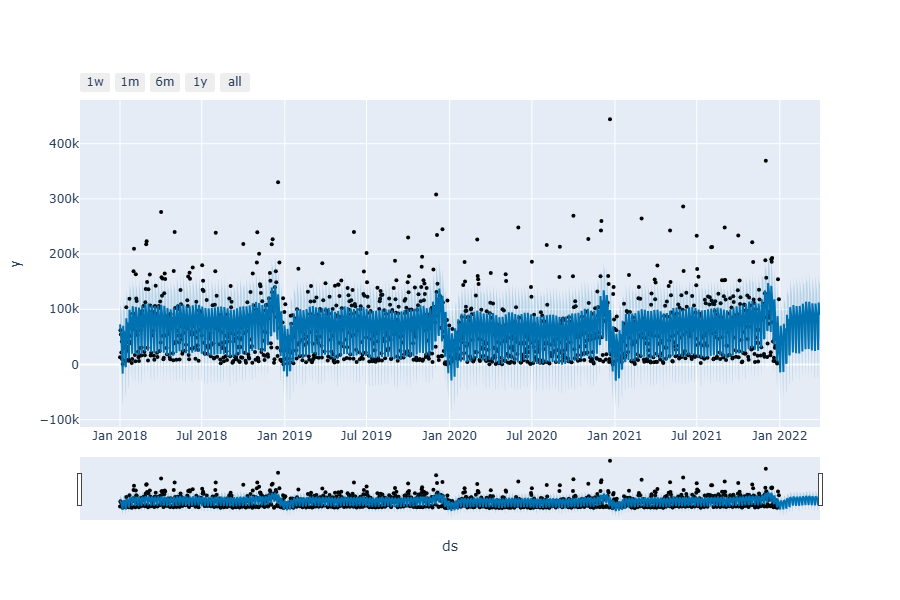
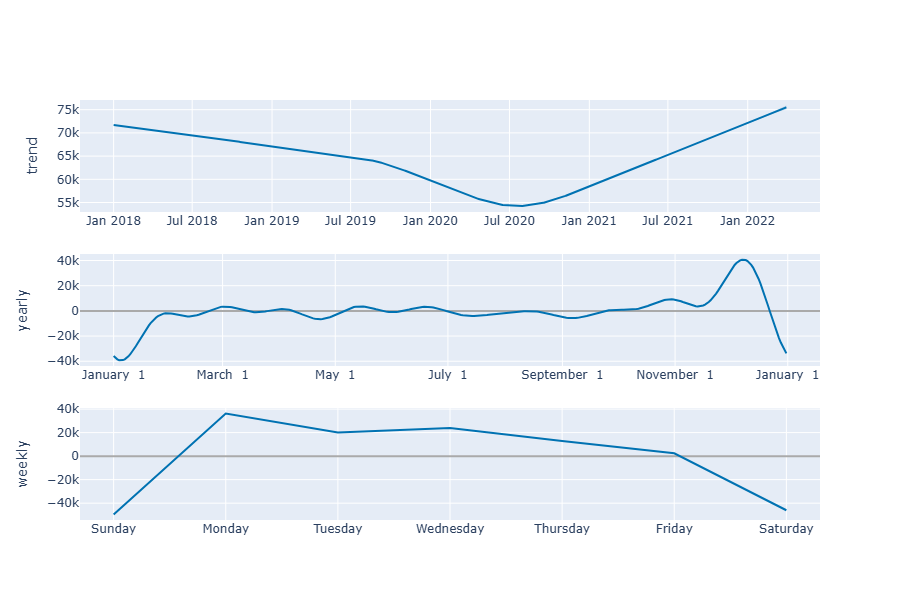

# 📊 Análise e Previsão de Gastos da Cota Parlamentar

## 📄 Descrição do Projeto
Este projeto em **Python** realiza uma análise completa dos gastos da **Cota para o Exercício da Atividade Parlamentar dos Senadores (CEAPS)**.  
O pipeline inclui:

- **Coleta e limpeza** dos dados de múltiplos arquivos CSV.
- **Padronização** e tratamento de valores ausentes.
- **Visualizações interativas** com **Plotly Express**.
- **Previsão de tendências** usando **Prophet** para os próximos 90 dias.

O objetivo é transformar dados brutos em um **relatório visual e interativo**, revelando padrões de despesa, comparações entre anos e senadores, e projeções de comportamento futuro.

---

## 🚀 Tecnologias Utilizadas
- **Python** – Linguagem principal.
- **Pandas** – Manipulação, limpeza e análise de dados.
- **Plotly Express** – Gráficos interativos.
- **Prophet** – Modelagem de séries temporais e previsão.

---

## ⚙️ Estrutura e Funcionalidades

### 1. Coleta e Limpeza de Dados
- Consolidação de dados de vários anos.
- Tratamento de valores ausentes (`DETALHAMENTO`, `DOCUMENTO`).
- Conversão e padronização de datas, meses e valores monetários.

### 2. Análise Exploratória e Visualizações
- **Gasto Anual Total**.
- **Top 10 Senadores por Gasto**.
- **Distribuição por Tipo de Despesa** (treemap).
- **Evolução Mensal dos Top 3 Senadores**.

### 3. Previsão de Gastos com Prophet
- Modelo treinado com dados históricos diários.
- Previsão para os próximos 90 dias.
- Intervalos de confiança para análise de incerteza.
- Gráficos de componentes (tendência, sazonalidade semanal e anual).

---

## 📊 Resultados

### 📌 Principais Descobertas
- **Menor gasto anual**: 2020 registrou o menor valor da série analisada.  
- **Top 3 senadores estáveis**: Entre 2018 e 2021, três senadores mantiveram-se no pódio de maiores gastos.  
- **Principais despesas**: Passagens, mobilidade, alimentação, hospedagem e aluguel de escritórios.  
- **Top 10 senadores (total)**:  
  - **1º** Paulo Rocha — R$ 1,8M  
  - **2º** Eduardo Braga — R$ 1,78M  
  - **3º** Telmario Mota — R$ 1,77M  

---

## 🔮 Previsão

### Visão Geral
A previsão indica **tendência de aumento** nos gastos, com forte **padrão sazonal** e **alta variabilidade diária**.

**Principais padrões identificados:**
- **Alta flutuação diária** — picos de até R$ 400 mil em alguns dias.
- **Padrão sazonal anual** — picos em fevereiro, março e novembro; quedas em janeiro, junho/julho e dezembro.
- **Sazonalidade semanal** — gastos maiores de domingo a terça; quedas acentuadas de quinta a sábado.

---

## 📈 Implicações e Recomendações
1. **Planejamento Orçamentário** — considerar tendência de aumento para evitar déficits.  
2. **Antecipação de Picos** — preparar orçamento para meses e dias de maior gasto.  
3. **Monitoramento Ativo** — identificar rapidamente desvios que ultrapassem o intervalo de confiança.  
4. **Refinamento do Modelo** — incluir variáveis como calendário legislativo e eventos atípicos.

---

## 🖼️ Gráficos e Visualizações

### Gastos Anuais


### Top 10 Senadores por Gasto


### Distribuição por Tipo de Despesa


### Evolução Mensal dos Top 3 Senadores - 2018


### Evolução Mensal dos Top 3 Senadores - 2019


### Evolução Mensal dos Top 3 Senadores - 2020


### Evolução Mensal dos Top 3 Senadores - 2021


### Previsão de Gastos - Prophet


### Componentes da Previsão - Tendência, Sazonalidade Anual e Sazonalidade Semanal


---

## ⚙️ Como Executar o Projeto

Estrutura de pastas:

```
└── dados/
├── despesa_ceaps_2018.csv
├── despesa_ceaps_2019.csv
├── despesa_ceaps_2020.csv
├── despesa_ceaps_2021.csv
└── dataset_ceaps_forecasting.csv
├── imagens/
│   ├── gasto_anual_total.png
│   ├── top10_senadores.png
│   ├── treemap_despesas.png
│   ├── evolucao_mensal_top3_2018.png
|   ├── evolucao_mensal_top3_2019.png
│   ├── evolucao_mensal_top3_2020.png
|   ├── evolucao_mensal_top3_2021.png
│   ├── previsao_prophet.png
│   ├── componentes_da_previsão.png
├── analise_de_dados_ceaps.ipynb
└── README.md
```
## Passos:
1. Coloque todos os arquivos de dados na pasta `dados/`.
2. Execute o script Python principal (analise_de_dados_ceaps.ipynb).
3. O código irá:
   - Processar e limpar os dados.
   - Gerar as visualizações interativas.
   - Salvar o arquivo `previsao_gastos_ceaps.csv` com a projeção.
